# Oppgave 5

TODO: forklare bedre hvorfor vi velger visse settings

Da er det er på tide å sette opp API gateway! Hva er det sier du? En API gateway er et mellomlag som tar i mot alle API kall fra klientene og dirigerer dem til riktige microtjeneste. Dette gjør det mulig å både ha flere instanser av microtjenestene og å ha endepunkter som kombinerer data fra flere tjenester. En API Gateway kan også oversette mellom web-venlige og andre typer protokoller.

For å gi ett eksempel så kunne en nettbutikk brukt en API gateway til å ta i mot kall fra en mobilapp, sammle sammen data fra flere endepunkter (vareinfo, avslagspriser, reviews) for å så tilby en vare for personen som bruker appen.

API gatewayer er veldig fleksible, og man kunne sikkert kjørt en workshop bare på det. Så I denne workshoppen skal vi bare dyppe tæerne litt og lage en veldig enkel API Gateway som tar i mot en request og svarer med ett datasett.

## 5.1 Å Finne frem

Føst må vi finne frem til riktig sted i denne amason jungelen. Søk opp "API gateway" og velg tjenesten for å komme inn på riktig side.

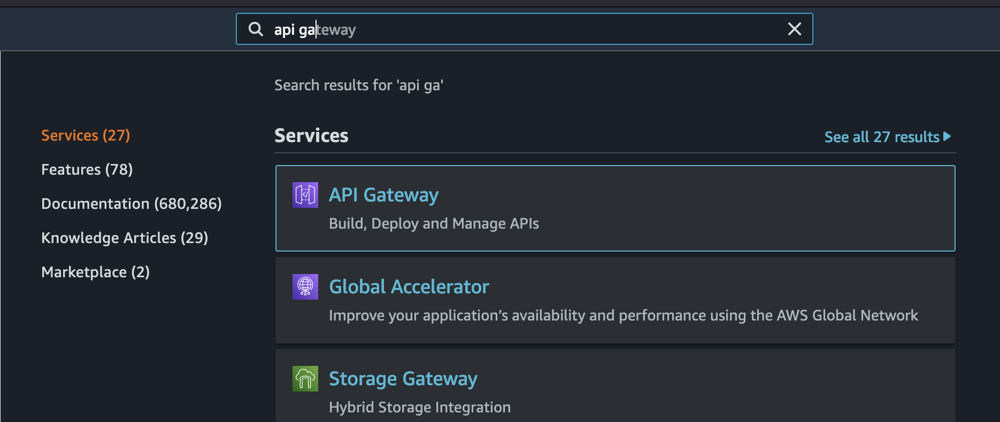

## 5.2 Skapelsen

Du vil nå se en liste med eksisterende API-gateways, men vi ignorer de for nå. Start med å trykke på den store oransje `Create API` knappen.

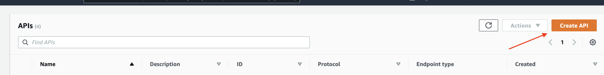

Du kommer så videre til en side som ber deg API type. Siden vi skal lage en veldig enkel gateway, velger vi `HTTP API`.

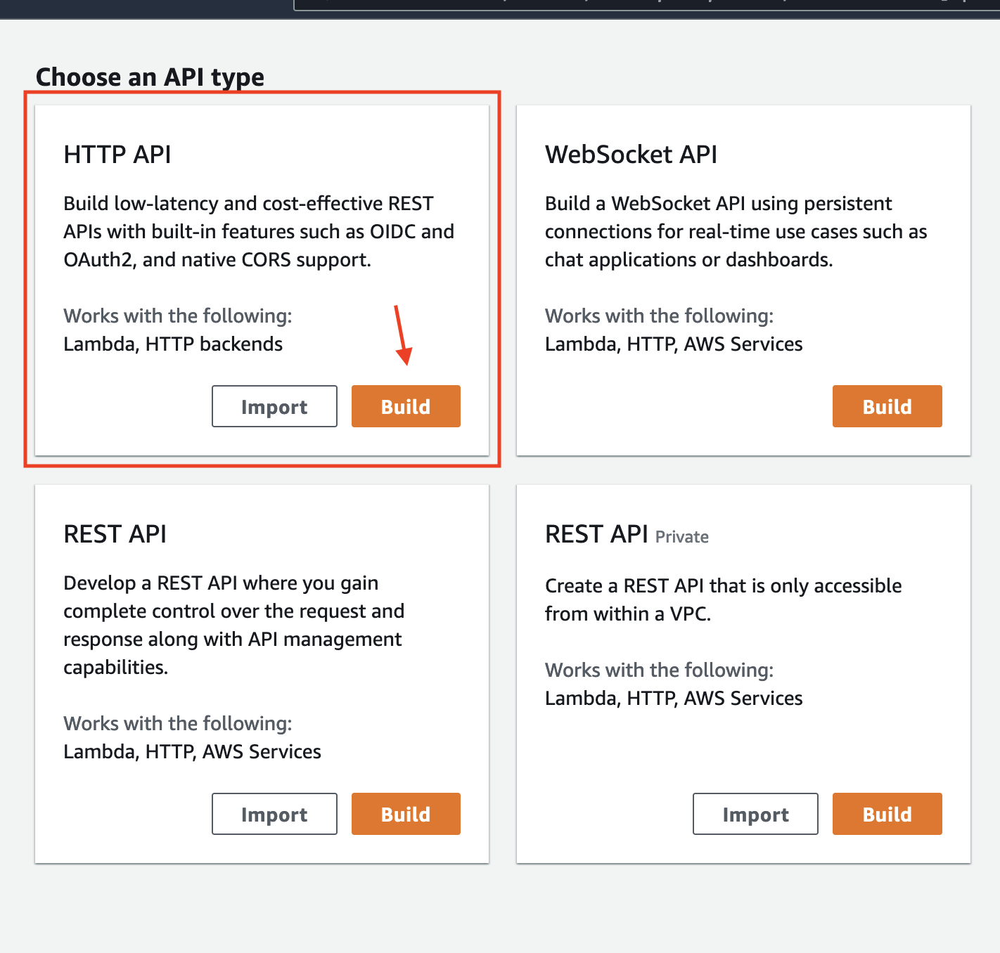

Så følger vi bare stegene slik de kommer.

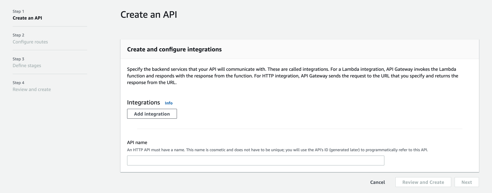

Trykk på `Add Integration` og velg `Lambda`. 

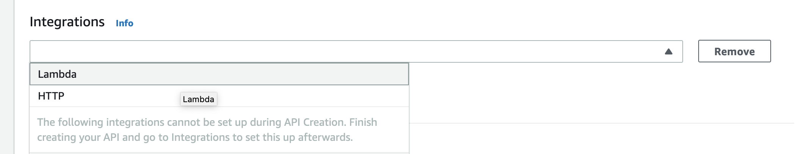

Skriv deretter inn navnet du ga lambdaen din i tidligere oppgave. Pass også på at du har valgt riktig region. Versjon kan du la stå på standarinstillingen, `2.0`.

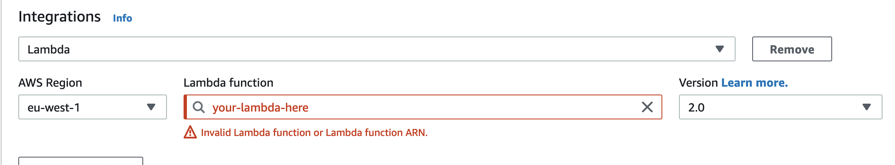

Velg ut et navn for gatewayen din og trykk `next`.

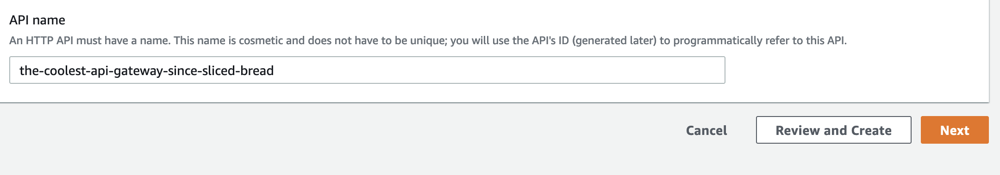

På `Configure routes` skjermen vil vi sette metoden til `GET` og definere en path som er litt lettere å huske, `/hytter` funker fint.

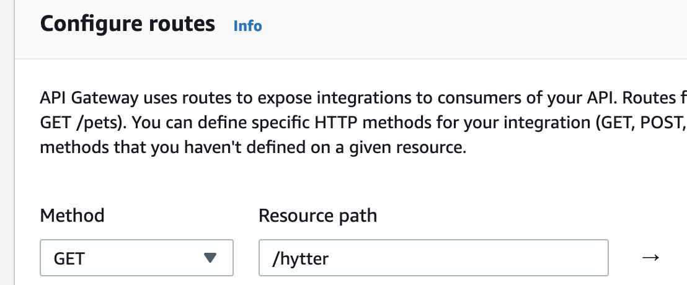

"Stages" her er litt som forskjellige miljøer eller forskjellige versjoner av gatewayen din. Her kunne man definert en gateway for prod, dev og test eller ha en egen beta-stage når en gjør store endringer. Siden dette er en workshop, trenger vi ikke å gjøre noe fancy her. Trykk deg videre med `Next`-knappen.

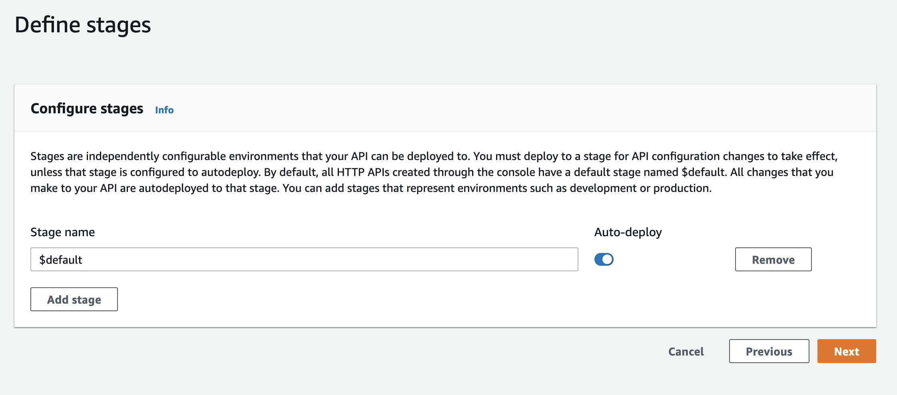

Se over at ting ser riktig ut, hvis de ikke gjør det kan du gå tilbake og fikse ting nå. Er alt OK kan du trykke `Create`.

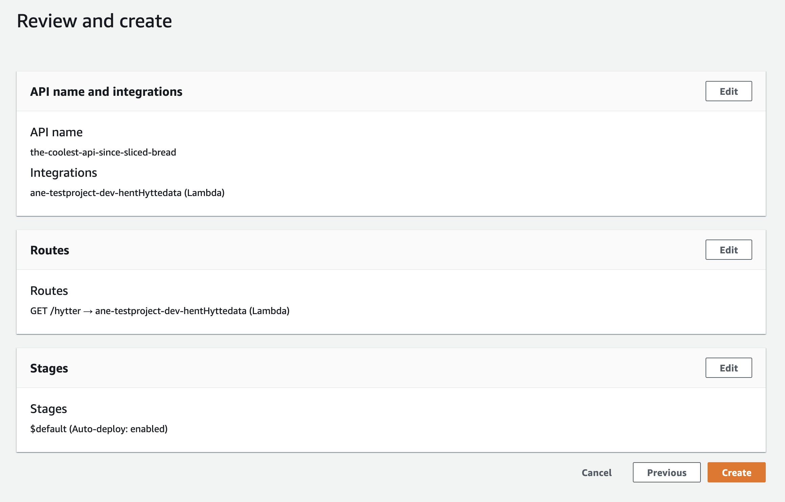

## 5.3 CORS

Dette er en typisk fallgruve når man leker med sky. I denne workshopen jukser vi litt og opner for alle tilganger. **IKKE** gjør dette på faksiske prosjekter ver så snill 😇

Trykk på `CORS` i sidemenyen.

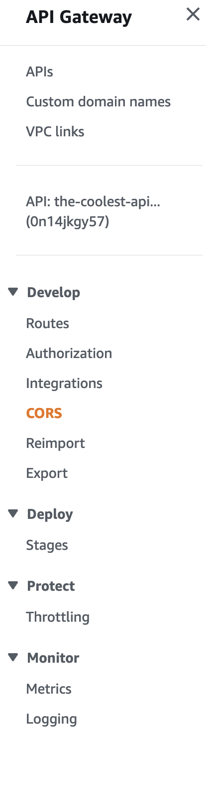

og så på `Configure`.

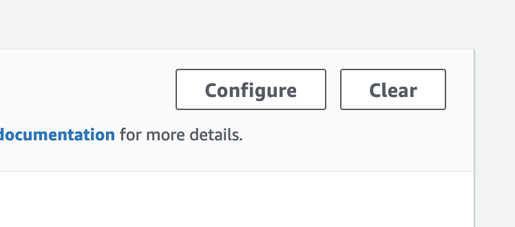

Så skriver du inn `*` i både `Access-Control-Allow-Origin` og `Access-Control-Allow-Headers`.

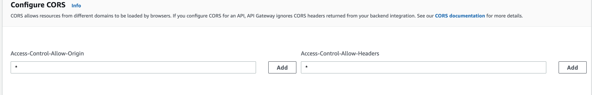

Tykk på `add` og de skal dukke opp under input feltene.

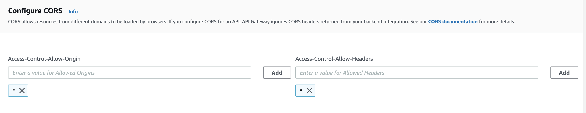

Igjen, måten vi løser dette på her er kun fordi det er en workshop, dette er fyfy 😡 å gjøre på prosjekt

TODO: fikse bilde, ha med get som metore i CORS

## 5.4 Prøvelsen 

Du vil se et grønt banner øvert som sier at gatewayen har blitt lagt. Klikk der eller gå tilbake til oversikten og finn gatewayen din. Finn `Invoke URL` på siden og kopier den. 

Vi kan nå prøve å kalle API-en med `CURL`(eller Postman hvis du foretrekker det). Husk å legge til endepunktet til URL-en din (`/hytter`)

`curl -x GET "<din URL>"`
